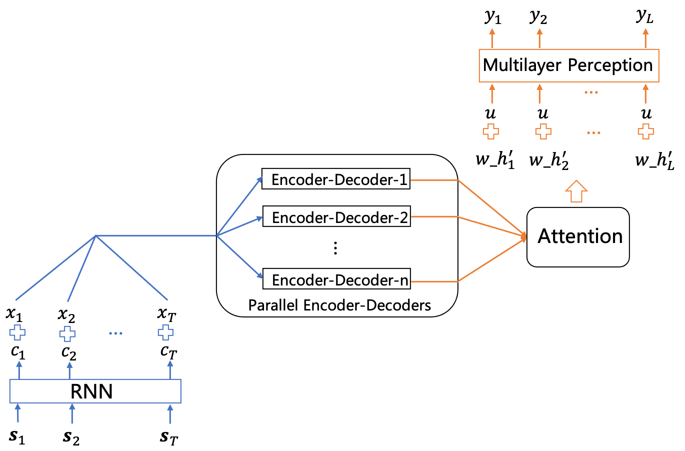

## 华为digix 2021 赛题1 冠军解决方案

### 1. 题目介绍
赛题提供200万匿名用户在60天内使用一款音乐app的行为数据，包括当天是否活跃、每天收听的歌曲、打开的页面、执行的动作，以及用户和歌曲的基本数据。赛题要求预测所有用户未来30天的留存情况。

### 2. 解题思路
本赛题已知用户的历史行为，预测用户未来的行为，本质上可以看作一个多步时间序列预测问题。我们可以使用RNN Encoder-Decoder来解决这一问题。Encoder负责学习历史行为的表征，Decoder则基于这样的表征来产生未来的预测结果。

### 3. 解决方案
* **数据处理**

  首先将原始数据分为三大类：
  1. 用户的基本信息（年龄、性别、城市、设备、是否是VIP、关注的话题数）
  2. 用户每天的静态数据（当天是否活跃、当天听歌总数、当天首次打开app的渠道）
  3. 用户每天的行为序列数据（当天打开的页面序列、执行的动作序列、收听的歌曲序列）
  
  三类数据的区别在于数据维度不同，基本信息是二维数据[用户数 * 特征数]，静态数据是三维数据[用户数 * 天数 * 特征数]，行为序列数据则是四维数据[用户数 * 天数 * 序列长度 * 特征数]。同时，针对三类数据的缺失值，我们采用常数填补的方法，即用从未出现过的数值（-1）来代替缺失值。
  
* **模型框架**

模型的基本结构如下图所示：

首先，将行为序列数据 *S_t* 通过RNN，使用RNN最后时刻隐藏层的状态 *c_t* 作为序列数据的表征。将 *c_t* 和静态数据 *x_t* 一起输入到并行的encoder-decoder中，在用attention机制对多个encoder-decoder的输出进行加权，得到加权后的decoder隐藏层状态 *w_ht* 。然后拼接用户基本信息*u*，输入多层感知机中预测最后的留存。

